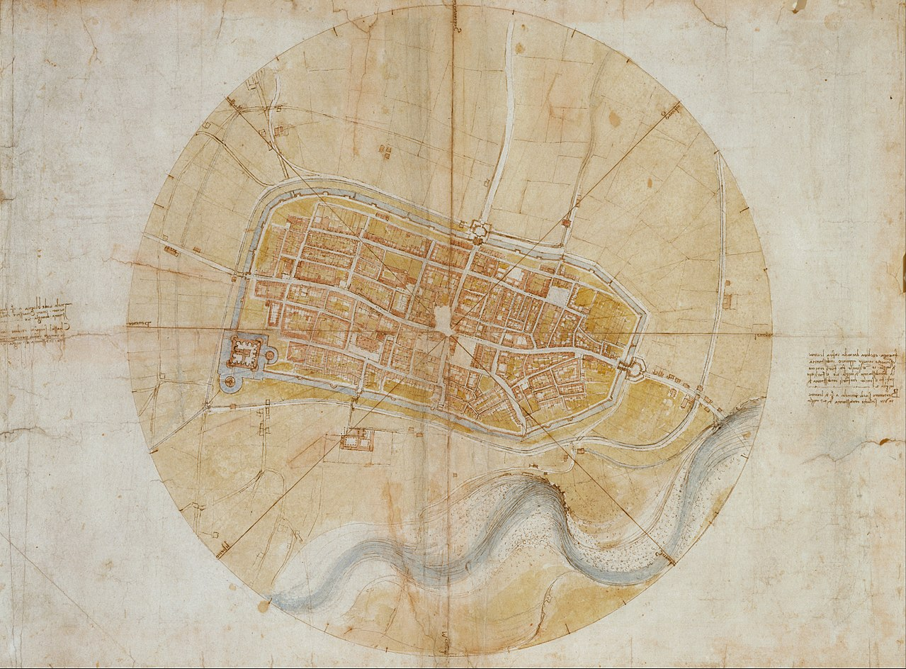
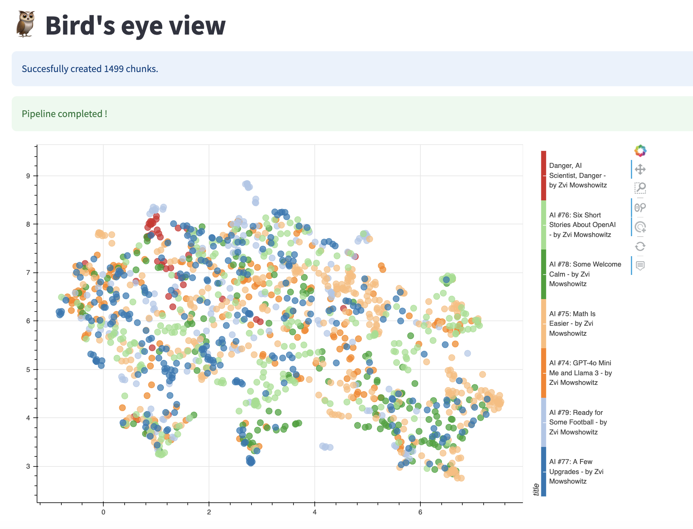
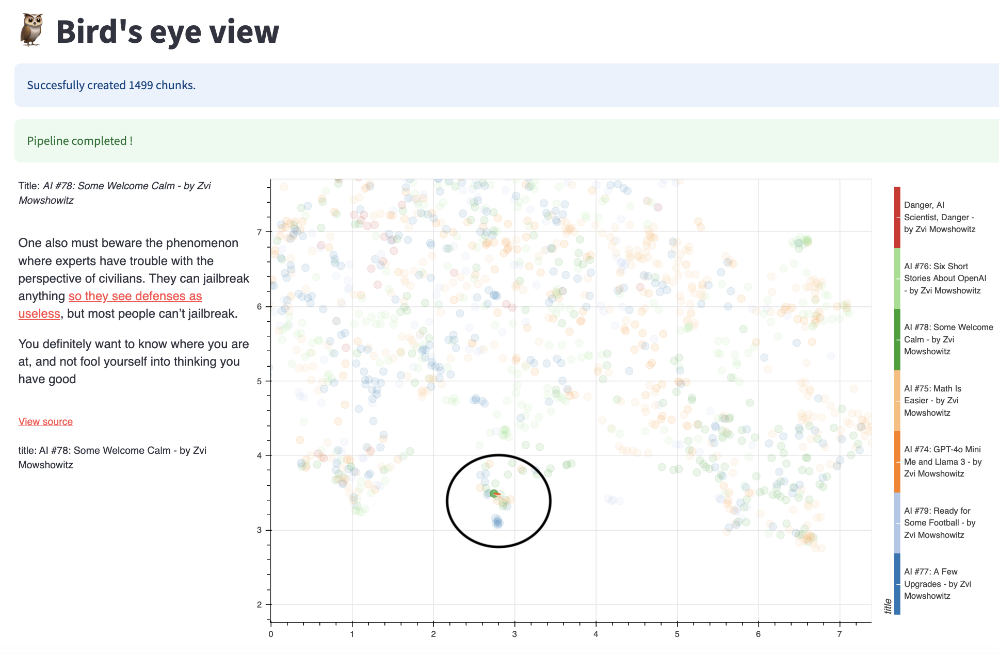
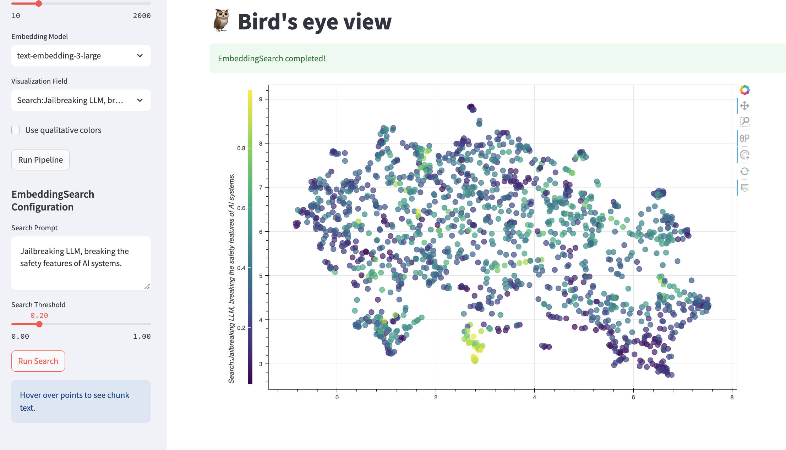
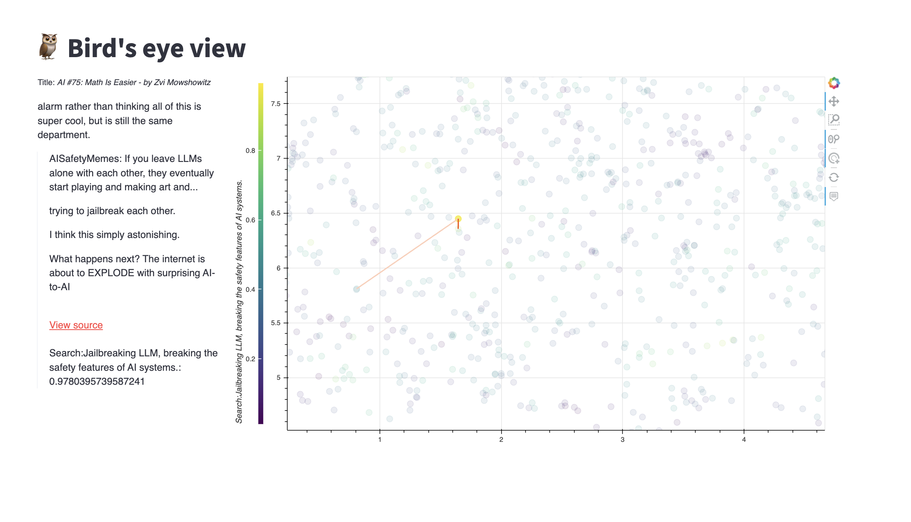
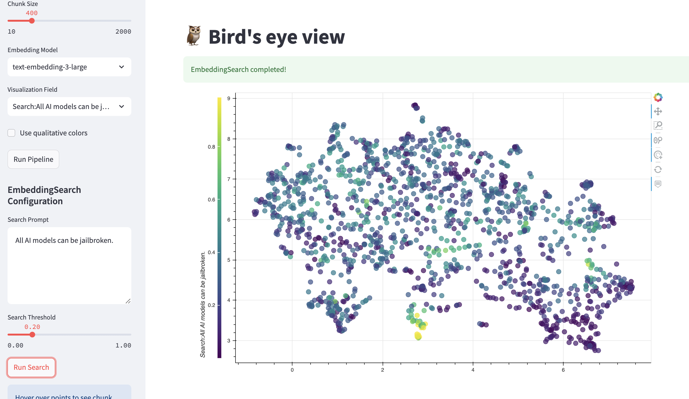

# 🦉 Bird's Eye View

⏩️ Online app available [here](https://birds-eye-view-app.streamlit.app/)

<br>
<br>




Bird’s eye view is an interactive visualization tool that lets you explore large collections of text from above, like looking at a landscape from an airplane. Instead of reading sequentially or filtering content, you get a complete view of the document’s scope while retaining the ability to zoom into specific areas.

## Setup


### Run the app

To run locally:
```
pip install -e .
streamlit run app.py
```

You can also install the python library to create interactive visualisation from you code with
```
pip install git+https://github.com/aVariengien/birds-eye-view.git
```

You need to have `OPENAI_API_KEY` defined in your environment variables. I advise adding `export OPENAI_API_KEY=sk-...` in your `.bashrc`.

The project is in very early stage, and might return errors.

**Price:** The large embedding model is at $0.130 / 1M tokens. A 400 character chunks is ~ 80 tokens. So a corpus of 1000 chunks is ~ $0.01. Given how cheap it is, I'd advise using the large embedding model over the small one.

### Local embeddings

By default the app uses OpenAI embedding models. If you'd like to use bird's eye view while keeping the data private, you can use embedding models running locally.

1. Install [LM Studio](https://lmstudio.ai/)
2. Run a [local server](https://lmstudio.ai/docs/app/api) serving an embedding model such as `nomic embed text v1 5`, the default embedding model suggested in the LM Studio UI. 
3. Run the streamlit app, and click on the "Use Local Embeddings" in the "Advanced parameters" menu. The default parameters should work.
4. (Optional) To use the python library with local embeddings, you need to pass the parameters `base_url` (default is `http://localhost:1234/v1`) and `api_key` (default is `lm-studio`) to the `OpenAIEmbeddor` and `DotProductLabelor` objects when creating a `Pipeline`. See the file `tutorial/mmlu.py` for an example of custom pipeline.

## Usage and tutorials

The project contains an interactive application (also available online [here](https://birds-eye-view-app.streamlit.app/)), and a Python library `birds_eye_view`.

You can check the tutorials at `tutorials` to learn to use the python library. The notebook `minimal_example.py` is just you need to know to display a map of a list of strings, while `mmlu.py` presents the whole pipeline.

## Walkthrough

The maps are created by dividing each text into chunks, and using OpenAI embeddings models followed by UMAP to reduce the dimension. You can customize the pipeline in the configuration side pannel.

The tool supports importing text from webpages, or local and online PDF files. Webpages are preferred as they contain style information.

Here is an example of a map of the last 
[Zvi Mowshowwitz's newsletters](https://thezvi.substack.com/).



Each point is a chunk. We can click on the chunk to see its content. The dark orange line points to the next chunk in the text, the light orange line to the previous. _View source_ links to the chunk in the original webpage.

## Example Workflow

When loading a new corpus, I'd advise setting the `n_neighbors` parameter of UMAP low (15-20). The visualization will focus on local structure, creating bundles of points.

Your goal is to understand: what are these clusters about? If they are clearly together, there is something that they have in common.

To understand what, focus on one cluster. Read the chunks, and make a guess. 

Let's focus on this cluster.



From reading a few chunks, it seems to talk about jailbreaks. Let's make a search.



The search embedds the prompt, and computes the dot product with all the embeddings in the corpus. It applies a sharpen filter on the results to filter the noisy values around 0.1, and boost the significantly high values. The `threshold` controls the sharpen function.

OK, the guess was good! It seems to light up the points in this cluster, but also some points in the middle of the map. Let's look at one of these outliers.



It also mentions jailbreaking. From reading the points in the cluster, the text seems to emphasize how easy it is to jailbreak models, whereas this point is mentioning jailbreaking in another context. 

Let's refine the prompt, we'll try `All AI models can be jailbroken`.



It seems a bit more specific, the previous outlier point lights up much less.

You got it, the goal is to engage in a back and forth to understand what precisely makes this cluster unique. 

After understanding the content of many clusters, one can increase `n_neighbors` and look at the global structure of the map.

## Future Use Cases

* After understanding a space, upload a new text you don't know. Understand this new text in comparison to the space you know. Look at a given text through many different prism.
* Analyzing thousands of generations of LLM. This could enable a loom with a high branching factor but low depth. Such a tool can be useful in brainstorming.
* Scaling up, making a map of a continent of information.
* Expert chess player engages in _chuncking_, ie. recongizing at a glace a certain configuration of the board. Could the back-and-forth described above enable text-chunking specialized for a corpus? Can I digest text faster if I have a mental model of the possible chunks I can find?
